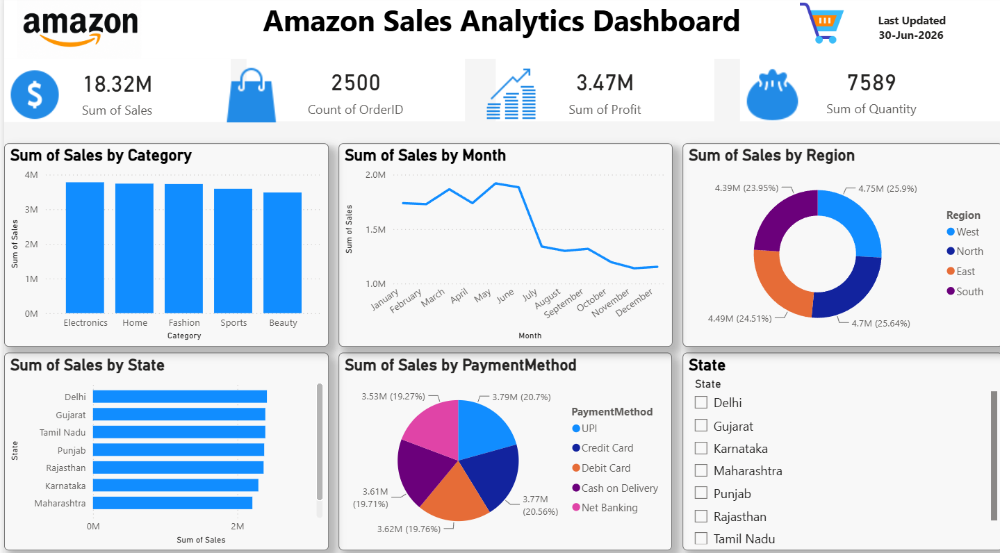

# 📊 Amazon Sales Analytics Dashboard

An interactive **Amazon Sales Analytics Dashboard** built using **Microsoft Excel** and **Power BI** to analyze sales performance, profit, orders, quantity, categories, regions, states, and payment methods.

---

## 📌 Project Overview

This dashboard provides valuable business insights by transforming raw Amazon sales data into an interactive visual report. It helps users monitor key business KPIs and identify sales trends, regional performance, and customer purchasing patterns.

---

## 🖼 Dashboard Preview



---

## 📈 Key Performance Indicators (KPIs)

- 💰 Total Sales: **18.32M**
- 📦 Total Orders: **2,500**
- 📈 Total Profit: **3.47M**
- 🛒 Total Quantity Sold: **7,589**

---

## 📊 Dashboard Features

- Sales by Category
- Monthly Sales Trend
- Sales by Region
- Sales by State
- Sales by Payment Method
- Interactive State Filter
- Clean and User-Friendly Dashboard Design

---

## 🛠 Tools Used

- Microsoft Excel
- Microsoft Power BI

---

## 📂 Dataset

The dataset contains Amazon sales transaction data including:

- Order ID
- Order Date
- Customer Name
- Product Category
- Product Name
- State
- Region
- Quantity
- Unit Price
- Discount
- Sales
- Profit
- Payment Method

---

## 📁 Repository Structure

```
Amazon-Sales-Analytics/
│
├── Amazon_Sales_Dashboard.pbix
├── amazon_sales_data.xlsx
├── dashboard.png
├── README.md
└── LICENSE
```

---

## 💡 Key Insights

- Electronics generated the highest sales.
- Sales peaked during the first half of the year.
- Regional sales distribution is balanced across all regions.
- UPI and Credit Card are the most preferred payment methods.
- Delhi recorded the highest sales among all states.

---

## 🚀 Future Improvements

- Sales Forecasting
- Customer Segmentation
- Profit Analysis by Product
- Dynamic Date Filters
- Mobile Optimized Dashboard

---

## 👨‍💻 Author

**Sharad Savita**

MCA Student | Data Analyst | Power BI Developer

### Connect with Me

- GitHub: https://github.com/sharadsavita
- LinkedIn: https://www.linkedin.com/in/sharad-savita-a08955368

---

⭐ If you found this project helpful, don't forget to **Star** this repository.
